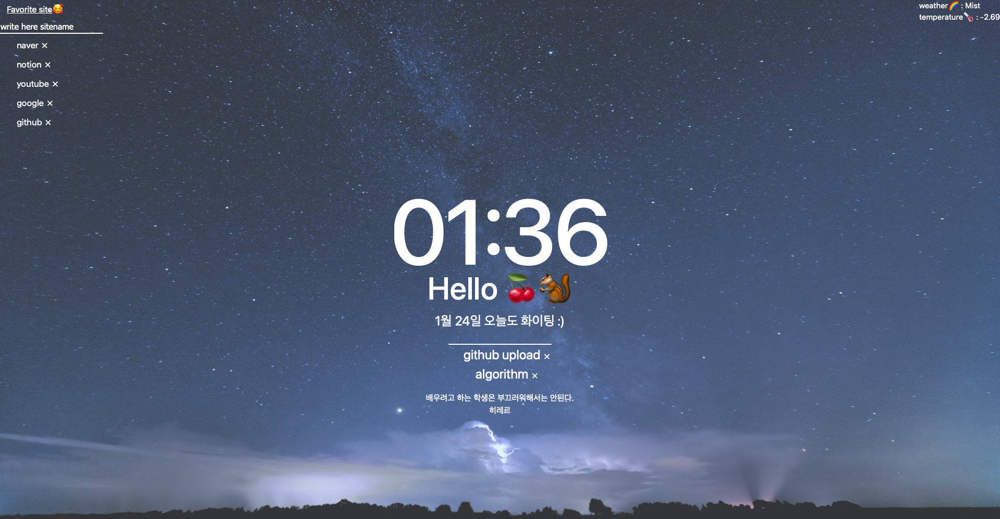

# vanillaJS-momentum-clone-coding
Let's clone code momentum with Nomadcoder. Technology stack :) HTML, CSS, JS

I wrote javascript and a few html while watching the nomadcoder lecture, and CSS wrote it myself. 
Based on the lecture, I implemented a favorite site that was not included in the lecture. 
Other details have also been embodied.

NomadCoder Lecture Link -> https://nomadcoders.co/javascript-for-beginners

My Project Development Process Note (KOR) -> https://daram-daram.notion.site/vanilaJS-momentum-clonecoding-note-b63bcab8e4d844538bbf202db022385b

📸 screenshot

✅ Things to improve.
In the link part, https://www.${newurl.text}.com/ If it is not www or does not end with .com, the site cannot be entered.

> The user must save the URL and site name to be.
> 👆🏻 implement later

Please let me know what to add or improve.😎

git.io.website -> https://murramge.github.io/vanillaJS-momentum-clone-coding/
